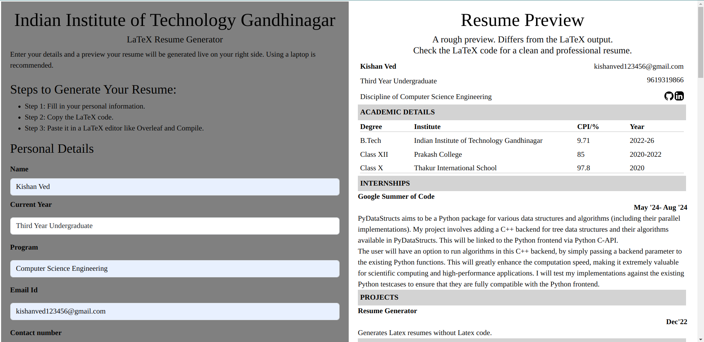
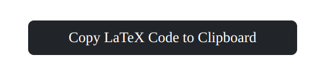

# Professional LaTeX Resumes, In Minutes!

A tool to help students and professionals create polished, professional LaTeX resumes without writing a single line of LaTeX code. Integrated with an AI assistant to enhance the resume! 

### **Live Site**: [Resume Generator](https://kishan-ved.github.io/resume_generator/resumegenerator.html)

This project follows the **CDS IITGN (Placement Cell of IIT Gandhinagar)** template guidelines, ensuring resumes meet professional standards.

## **Key Features**
- Generate professional LaTeX resumes effortlessly.
- Live preview as you input details.
- Simple copy-paste process for any LaTeX editor (e.g., Overleaf).

## **Steps to Generate Your Resume**

- Fill in your personal details.
- Click **Copy LaTeX Code to Clipboard**.
- Paste the copied code into a LaTeX editor (e.g., Overleaf) and compile.

## **Website Tour**

### **1. Input Your Details**
Fill out the form on the left. As you type, your resume will update in real-time on the right-hand side.  


### **2. Copy LaTeX Code**
Once complete, click the **Copy LaTeX Code to Clipboard** button.  


### **3. Compile Your Resume**
Paste the LaTeX code into your preferred editor (e.g., Overleaf), compile, and download your professional resume.  

## **Example Resume**

Here's a resume that was generated using this tool.


## **Contributing to the Project**

We welcome contributions to improve the project. Follow these steps to contribute:

### **Getting Started**

- Fork the repository: `https://github.com/Kishan-Ved/resume_generator`
- Clone your fork: `git clone https://github.com/<your-github-username>/resume_generator.git`
- Change your working directory: `cd resume_generator`
- Execute: `git remote add origin_user https://github.com/<your-github-username>/resume_generator/`
- Create a new branch for your changes: `git checkout -b <your-new-branch-for-editing>`
- Make your edits and save the changes.
- Stage your changes: `git add .`
- Commit your changes: `git commit -m "Brief description of your changes"`
- Push your branch to your fork: `git push origin_user <your-feature-branch>`
- Open a Pull Request (PR) to the main repository.


✨ `Pro Tip`: Before starting your work, always switch to the `main` branch and pull the latest changes using the remote `origin_user`. Then, jump right into Steps 5 to 10 to begin contributing!

Happy Contributing!

## Contributor Guidelines

### Variable Naming Practices

- Use **camelCase** for variables (`userInput`, `formPreview`).
- Prefix IDs and classes with meaningful names (`formInputField`, `copyButton`).
- Avoid abbreviations unless widely understood (`contactNumber` over `cntNo`).

### Image Naming

- Use descriptive names for images (`form_preview.png`, `resume_example.png`).
- Separate words with **underscores** for readability.

### Commenting Practices

- Use comments to explain why a piece of code exists, not just what it does.
- Start with a clear summary for functions:

```
/**
 * Copies LaTeX code to clipboard.
 * - Retrieves user-entered details.
 * - Populates LaTeX fields.
 * - Executes clipboard copy command.
 */

```

- Inline comments should be concise and address complex or non-obvious logic:

``` Check if PhD details are empty; if so, hide the section. ```

### Code Format

- Indent with 2 spaces.
- Ensure consistent bracket placement:

``` 
if (condition) {
  // Code block
}
```

- Separate logical sections with line breaks for readability.

## Acknowledgments

This tool was crafted to simplify resume creation for students and professionals, with inspiration drawn from the CDS template at IIT Gandhinagar.

---

Made with ❤️ by Kishan Ved.
